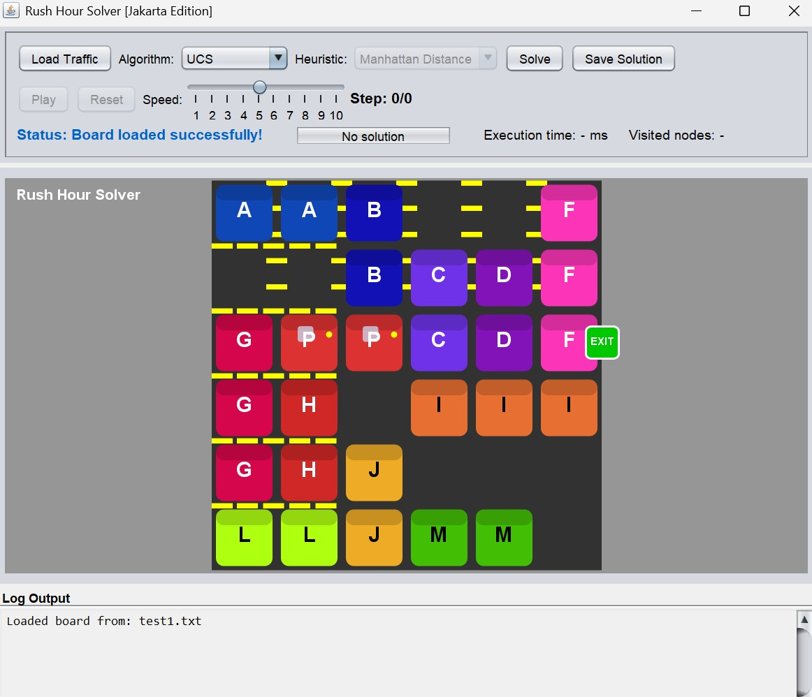

# 🚗 Rush Hour Solver - Tucil3_13523120


### Bevinda Vivian — 13523120  
Tugas Kecil 3 - IF2211 Strategi Algoritma  
Sekolah Teknik Elektro dan Informatika — ITB
---

## Deskripsi Singkat

**Rush Hour Solver** adalah program yang menyelesaikan permainan papan _Rush Hour_ secara otomatis menggunakan berbagai algoritma pencarian, yaitu:

- Uniform Cost Search (UCS)
- Greedy Best First Search (GBFS)
- A* Search
- Beam Search (Bonus)

Program ini dilengkapi antarmuka berbasis **Command Line Interface (CLI)** dan **Graphical User Interface (GUI)** menggunakan Java Swing. Pengguna dapat memilih algoritma, heuristik, dan melihat solusi animasi pada GUI.

---

## Requirement

- **Java**: Java 8 atau lebih tinggi (Java 8/11/17 direkomendasikan)
- **Library eksternal**: Tidak diperlukan — cukup Java SE

---

## Struktur Folder
├── bin/                            
├── doc/                            
├── src/                            
│   ├── App.java                   
│   ├── AStar.java                 
│   ├── BeamSearch.java            
│   ├── Board.java                 
│   ├── GBFS.java                  
│   ├── Heuristic.java             
│   ├── Main.java                  
│   ├── Piece.java                 
│   ├── SearchResult.java          
│   ├── State.java                 
│   ├── UCS.java                   
├── test/                          
├── README.md     

---

## Compile Program

Clone repositori ini menggunakan perintah:

```sh
git clone https://github.com/bevindav/Tucil3_13523120.git
cd Tucil3_13523120
```

Pastikan kamu berada di direktori root (`Tucil3_13523120/`), lalu jalankan:

```sh
javac -d bin src/*.java
```

Lalu ada dua cara untuk menjalankan program ini yaitu dengan **CLI** atau dengan **GUI**

**CLI**:
```sh
java -cp bin Main
```
Lalu pilih file puzzle dari folder test/, pilih algoritma pencarian (UCS, GBFS, A*, Beam Search). Dan lihat solusi, waktu pencarian, jumlah node yang dibangkitkan, dan langkah-langkah penyelesaian, serta simpan jika ingin.

**GUI**:
```sh
java -cp bin App
```
Lalu pilih file txt yang diinginkan, pilih algoritma pencarian (UCS, GBFS, A*, Beam Search). Dan lihat solusi, waktu pencarian, jumlah node yang dibangkitkan, dan langkah-langkah penyelesaian, serta simpan jika ingin.
